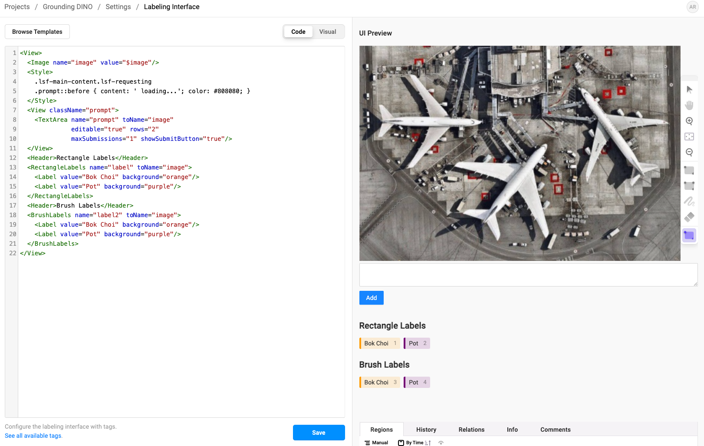
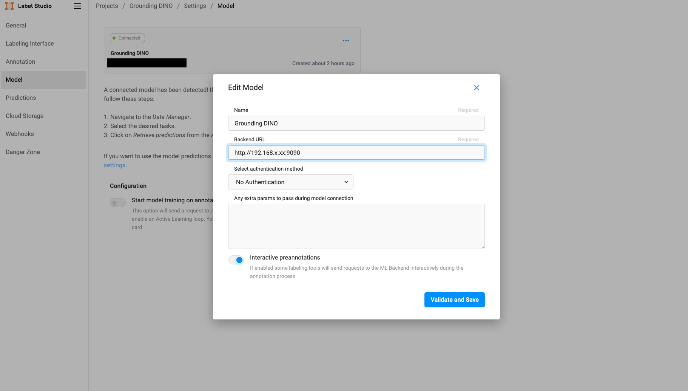
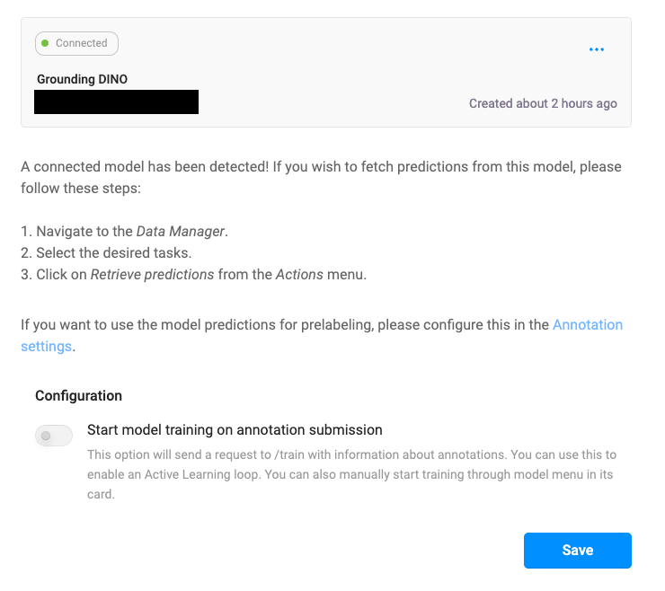
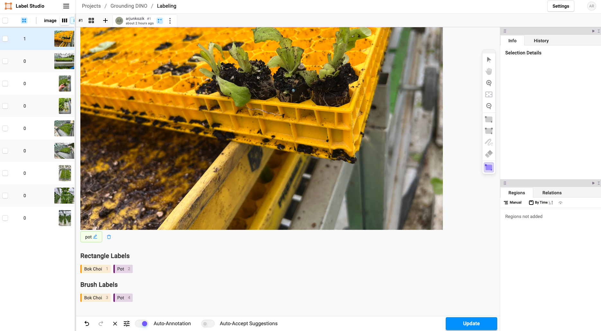
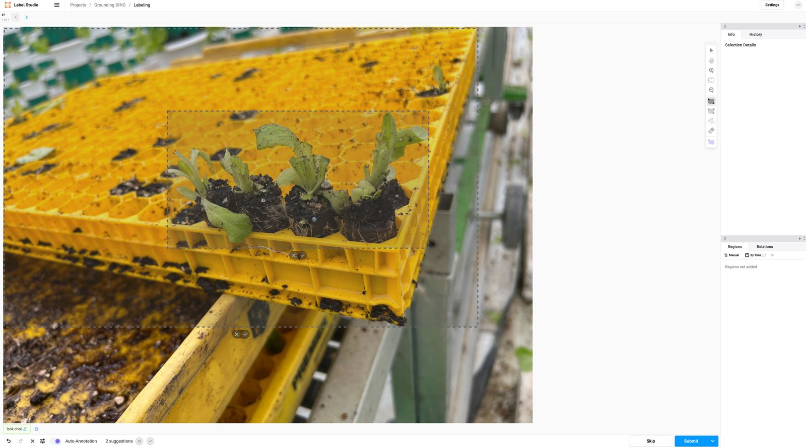

# Introduction

Building upon the previous exploration of using the Segment Anything Model (SAM) with Label Studio for zero-shot object identification, this guide focuses on advancing this application by integrating Grounding SAM for automated object identification and segmentation. The Grounding SAM, along with Grounding DINO, leverages text labels to significantly speed up the image annotation process, providing a more efficient workflow for your annotation team.

## What is the Label Studio ML backend?

The Label Studio ML backend is an SDK that lets you wrap your machine learning code and turn it into a web server.
The web server can be connected to a running [Label Studio](https://labelstud.io/) instance to automate labeling tasks.

## What is Grounding SAM?

Grounding SAM is an extension of the Grounding DINO model which incorporates the Segment Anything Model to provide precise image segmentation masks instead of just bounding boxes. This is particularly useful for detailed object identification tasks required in image segmentation.

## Grounding DINO ML Backend Overview

The Grounding DINO ML backend supports both Grounding DINO and Grounding SAM models and is packaged with a Dockerfile for easy deployment on both GPU and CPU systems. This backend simplifies the setup and use of these advanced models in a production environment.

```bash
cd label-studio-ml-backend/label_studio_ml/examples/grounding_dino
```

Build the docker container for the SAM or Grounding DINO backend. This container will attach work with the label studio docker to help with the segmentation of your data.

```bash
docker compose build
```

You should see something like this:

```bash
❯ docker image list

REPOSITORY                  TAG       IMAGE ID       CREATED       SIZE
grounding_dino-ml-backend   latest    d8e9c1c8a537   2 minutes ago 5.48GB
```

## Using the Grounding DINO ML Backend
With the image built, it’s time to build an image segmentation project using Label Studio.

### Install Label Studio
First, you need to install Label Studio. For this example, the Grounding DINO ML Backend relies upon enabling local storage serving. To start an instance of Label Studio with this turned on, enter the following commands:

```bash
docker image pull heartexlabs/label-studio:latest

docker run \
    -it --rm -p 8080:8080 \
    -v $(pwd)/mydata:/label-studio/data \
    --env LABEL_STUDIO_LOCAL_FILES_SERVING_ENABLED=true \
    --env LABEL_STUDIO_LOCAL_FILES_DOCUMENT_ROOT=/label-studio/data/images \
    heartexlabs/label-studio:latest
```

This will run the label studio docker container and make the UI available at http://localhost:8080. The docker will also enable file serving and store a database on you machine.

You might have issues using localhost:8080 is this does not work try swapping local host for your IP address.

## Set up a project

Once you have created your account, "Create a Project" and import your data. When set up your labelling environment, you need to select the "Custom Template" option

<p align="center">
  
</p>

Here paste in the provided configuration.

```xml
<View>
  <Image name="image" value="$image"/>
  <Style>
    .lsf-main-content.lsf-requesting 
    .prompt::before { content: ' loading...'; color: #808080; }
  </Style>
  <View className="prompt">
    <TextArea name="prompt" toName="image" 
              editable="true" rows="2"
              maxSubmissions="1" showSubmitButton="true"/>
  </View>
  <Header>Rectangle Labels</Header>
  <RectangleLabels name="label" toName="image">
    <Label value="Bok Choi" background="orange"/>
    <Label value="Pot" background="purple"/>
  </RectangleLabels>
  <Header>Brush Labels</Header>
  <BrushLabels name="label2" toName="image">
    <Label value="Bok Choi" background="orange"/>
    <Label value="Pot" background="purple"/>
  </BrushLabels>
</View>
```

You can add and edit the labels as you see fit. I have provided two labels for this project: "Bok Choi" and "Pot".

<p align="center">
  
</p>

## Start the Grounding DINO/ Grounding SAM backend to Label Studio

In order to link the gronuding docker to the label studio docker open the `docker-compose.yml` file and edit the following lines to include your Label Studio host and API access keys. The API access keys can be found in the settings of the project you created on the label studio ui.

```yml
- LABEL_STUDIO_HOST=http://<YOUR_HOST_IP_ADDRESS_HERE>:8080
- LABEL_STUDIO_ACCESS_TOKEN=<YOUR_ACCESS_TOKEN_HERE>
```

Once you have made these changes, run:

```bash
docker compose up
```

At this point you might see a number of debug messages where the docker is trying to get a lock on the bert model's endpoint. This might take some time but its should resolve itself 

```bash
grounding_dino  | [2024-07-04 21:19:49,471] [DEBUG] [filelock::acquire::266] Lock 278521928320 not acquired on /root/.cache/huggingface/hub/.locks/models--bert-base-uncased/68d45e234eb4a928074dfd868cead0219ab85354cc53d20e772753c6bb9169d3.lock, waiting 0.05 seconds ...
grounding_dino  | [2024-07-04 21:19:49,527] [DEBUG] [filelock::acquire::254] Attempting to acquire lock 278521928320 on /root/.cache/huggingface/hub/.locks/models--bert-base-uncased/68d45e234eb4a928074dfd868cead0219ab85354cc53d20e772753c6bb9169d3.lock
```

## Connect the ML Backend

Now you need to go back to your project settings and navigate to the "Model" section. Here if you fill in the details for the “Title” and the “URL”. The URL will be your local IP address and port 9090. Flick to enable the “Use for interactive preannotations” switch and save your settings.

<p align="center">
  
</p>

If a sucessful connection is made then you should see a green connection status as shown in the image below.

<p align="center">
  
</p>

## Bounding Box and Segmentation Mask Labeling with Text Prompts

At this point we should have something like this and we should be able to enter a natural-language query in the text field to prompt the Grounding DINO/ SAM model to make a prediction.

<p align="center">
  
</p>


### Current BUG

Currently the grounding docker is not able to access the images uploaded to the server due to some networking issues or some pathing which might have been overlooked.

### BUG fixed

<p align="center">
  
</p>

```txt
grounding_dino  | [2024-07-04 20:57:57,385] [ERROR] [dino::one_task::172] Error getting image path: Can't resolve url, neither hostname or project_dir passed: /data/upload/1/afea8d2c-IMG_4708.jpg. You can set LABEL_STUDIO_URL environment variable to use it as a hostname.
```