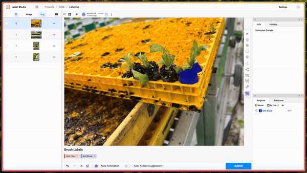
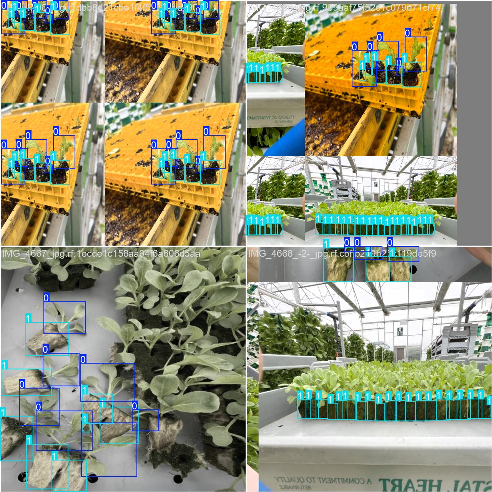
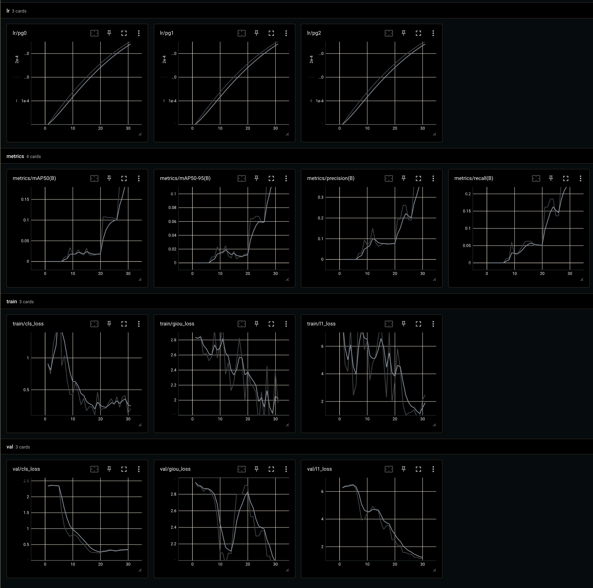

# Update 1 August 2024: Ingelligent labelling and training Pipeline

Setup guide is moved to Setup.md. (might need updating TODO)

## Data labeling tool

A labelling tool has been created with the help of label studio. SAM has been used as the back end to speed up the labelling process.

  
  

The above images show the labeling process. With the help of SAM we can label data with:

- Bounding boxes
- Single or multiple key-points
- Single or multiple anti-points

Data created on label studio can be export in several formats, however at the moment we are only able to export in the naitive JSON format. There is an issue here with the decoding of the rle encoded segmentation masks. Bug needs resolving to export into YOLO and COCO formats needed for training most models.

  
  

### Additional resources

https://drive.google.com/drive/folders/1A_PvpK6FkH8OrVTVA_qmgJvJcaZiDUiE

here you will find:
•⁠  ⁠rle labels from our labelling tool
•⁠  ⁠⁠yolo format labels
•⁠  ⁠⁠coco format labels
•⁠  ⁠⁠2 videos of me labelling data with our tool
•⁠  ⁠⁠1 video of me exporting the data and showing the various data formats we have (only json is working atm cause re rle bug)
•⁠  ⁠⁠4 screenshots of images labelled via label studio.

## Model Training

We labelled 4 images from the dataset provided as a priliminary test of the system. The images were used to train the model.

  
  

Above we have the an example of inference and the output training graphs.

### Additional resources

https://drive.google.com/drive/folders/1meHi3TPypQ5THL183wbcaWkj_4tNue5X

here you will find:
•⁠  ⁠training graphs
•⁠  ⁠⁠sample images
•⁠  ⁠⁠ model weights

NOTE:
•⁠  ⁠when we figure out the encoding bug if all goes well we will have the coco and yolo format labels as well.
•⁠  ⁠⁠I have only labelled 4 images for this experiment
•⁠  ⁠⁠model is trained on the yolo json labels produced from roboflow because we werent able to convert out label studio rle segmentation masks into polygons

NEXT STEPS:
•⁠  ⁠figure the damn rle bug out
•⁠  ⁠⁠collect/ generate more data
•⁠  ⁠⁠train model as we collect more data